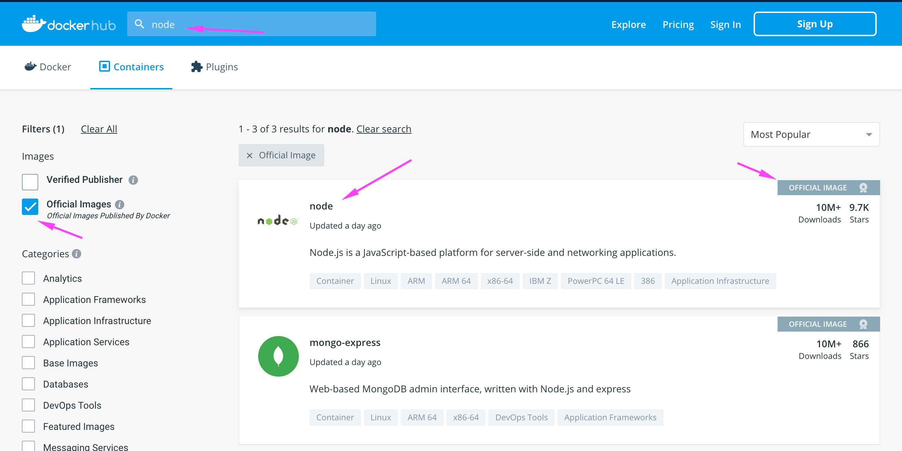
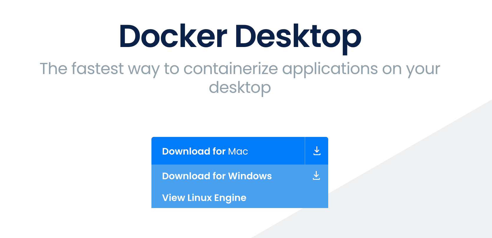

## What is Docker

> A standardized unit of software"

- docker.com

Docker is container runtime environment.

It isolates all software dependencies required to build and run an application into one neat and small (mostly) container.

### So what?

Well instead of installing Node.js, NPM, NVM, MongoDB, PHP on your LAPTOP all you have to do is pull down a Docker IMAGE that already has that software packaged inside of it ready for your to insert your web app into.

### so how does it work?

All you have to do use is pull down an image and build a container from it, it is in this container that your code will live.



You manage your containers using the Docker application on your development machine.

You manage your containers using the docker CLI (command line interface)

```bash
docker --help
```

You can:

- create
- delete
- publish
- configure

## Install Docker



### Clone image

```bash
docker pull node
```

Head over to your project 
```bash
cd docker101
```

## Build container

```bash
docker build -t docker101tutorial .
```

## Run your first container

```bash
docker run -d -p 81:81 --name docker-tutorial docker101tutorial
```

## What is a container?

## Now save and share your image

Save and share your image on Docker Hub to enable other users to easily download and run the image on any destination machine.
